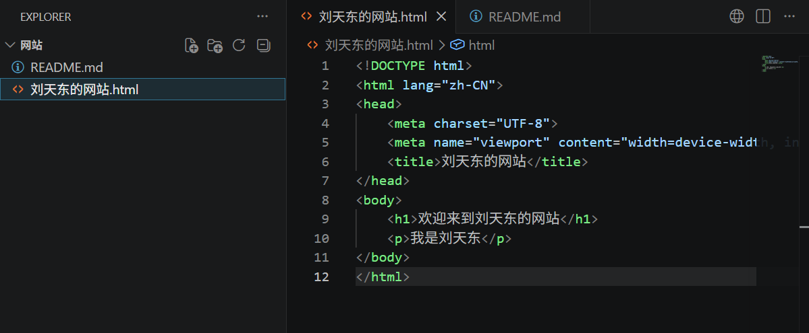
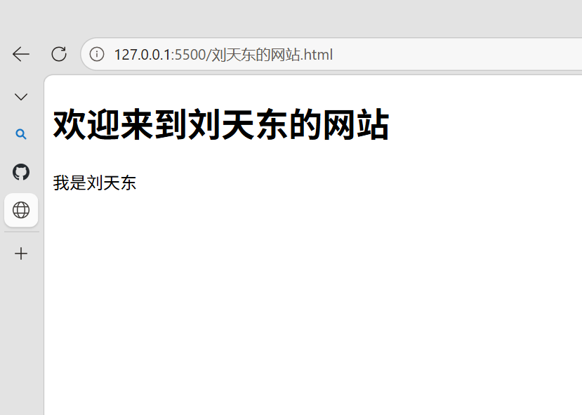
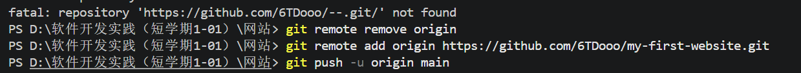

# 实验一：Web开发环境搭建与静态站点构建

| 实验名称 | Web开发环境搭建 | 实验类型 | 设计型 |
|---------|----------------|---------|--------|
| 姓名 | 刘天东 | 学号 | [25010104] |
| 组号 | [5] | 实验日期 | 2026年7月6日 |


## 1、实验目的

本次实验旨在从零开始搭建一套完整的 Web 开发环境，通过安装和配置代码编辑器、本地服务器等核心工具，最终成功构建并运行一个静态网页。通过本实验，理解 Web 开发环境的基本组成（编辑器 + 本地服务器 + 版本管理工具），掌握从“编写代码”到“浏览器预览”的完整工作流程。


## 2、实验环境

| 项目 | 详细说明 |
|------|---------|
| **操作系统** | Windows 11 专业版 23H2 |
| **代码编辑器** | Visual Studio Code 1.98.0 |
| **本地服务器** | Live Server 扩展（v5.7.9） |
| **版本管理** | Git 2.50.1 |


## 3、实验过程

### 步骤一：安装 VSCode 代码编辑器

访问 VSCode 官网（https://code.visualstudio.com/），根据操作系统版本下载对应的安装包。双击运行安装程序，按照向导提示完成安装，安装路径保持默认即可。


*图1：VSCode 官网下载页面*

安装完成后，打开 VSCode，点击左侧活动栏的“扩展”图标，搜索并安装 **Chinese (Simplified) Language Pack** 中文语言包，重启后界面切换为中文，便于后续操作。


*图2：VSCode 中文语言包安装界面*

### 步骤二：安装 Live Server 扩展

在 VSCode 扩展商店中搜索 **Live Server**，找到作者为 **Ritwick Dey** 的扩展，点击“安装”。安装完成后，VSCode 右下角状态栏会出现蓝色的 **“Go Live”** 按钮，表示扩展已成功启用。


*图3：VSCode 扩展商店中的 Live Server 插件*

> **知识点**：Live Server 是一个轻量级的本地开发服务器，它会在本地启动一个 HTTP 服务，监听文件变化并自动刷新浏览器，实现“保存即预览”的高效开发体验。
### 步骤三：创建项目文件夹并编写网页

#### 3.1 创建项目文件夹

在桌面新建一个文件夹，命名为 `网站`。打开 VSCode，点击“文件” → “打开文件夹”，选择该文件夹，将其作为项目工作区。

#### 3.2 新建 HTML 文件

在 VSCode 左侧资源管理器中，右键点击空白区域 → 选择“新建文件”，命名为 `index.html`（注意后缀必须是 `.html`）。


*图3：在 VSCode 中新建 HTML 文件*

## 4、实验结果
最终实验结果展示。


*图4：网站界面展示*

## 5、第一个实验知识点总结

本次实验涉及的核心知识点可分为三大类：**开发环境组成**、**HTML基础语法**、**工具链协同工作**。

### 5.1 核心工具与概念

| 工具/概念 | 类型 | 核心作用 | 本次实验中的关键操作 |
|-----------|------|----------|----------------------|
| **VSCode** | 代码编辑器（IDE） | 提供代码编写、语法高亮、文件管理、扩展插件等核心编辑功能 | 打开项目文件夹、安装 Live Server 扩展、编写 HTML 代码 |
| **Live Server** | VSCode 扩展插件 | 在本地启动一个轻量级 HTTP 服务器，监听文件变化并自动刷新浏览器 | 右键 `index.html` → Open with Live Server |
| **HTML (超文本标记语言)** | 标记语言（非编程语言） | 定义网页的**结构**和**内容**，是网页的骨架 | 使用标签编写 `index.html`，定义标题、段落、图片等元素 |
| **静态站点** | 网站架构类型 | 内容固定，无需数据库和后端服务支持，直接由浏览器解析 HTML/CSS/JS | 通过 Live Server 直接预览，无后端交互需求 |
| **本地服务器** | 网络服务概念 | 在本地计算机上模拟远程服务器环境，方便开发和调试 | Live Server 在 `127.0.0.1:5500` 提供 HTTP 服务 |


### 5.2 核心语法规则

| 规则 | 说明 | 正确示例 | 错误示例 |
|------|------|----------|----------|
| **标签成对出现** | 大多数标签有开始和结束，用 `/` 表示结束 | `<p>文字</p>` | `<p>文字`（缺少闭合） |
| **标签可嵌套** | 标签之间可以层层包裹，类似套娃 | `<div><p>文字</p></div>` | `<p><div>文字</p></div>`（交叉嵌套） |
| **属性写在开始标签内** | 用 `属性名="属性值"` 的形式添加额外信息 | `` | ``（缺少引号） |


# 实验二：代码编辑与管理

## 1、实验目的

本次实验旨在掌握代码编辑器的基本配置与使用，学习Markdown轻量级标记语言的语法规范，并通过Git版本管理工具实现对项目代码的版本控制。通过本实验，理解从“编写代码”到“文档化”再到“版本管理”的完整工作流，为后续团队协作开发奠定基础。


## 2、实验环境

| 项目 | 详细说明 |
|------|---------|
| **操作系统** | Windows 11 专业版 23H2 |
| **代码编辑器** | Visual Studio Code 1.98.0 |
| **版本管理工具** | Git 2.50.1 |
| **远程仓库** | GitHub（仓库名：my-first-website） |
| **项目路径** | `D:/软件开发实践（短学期1-01）/网站/` |
| **文档格式** | Markdown（.md） |


## 3、实验过程

### 步骤一：VSCode 编辑器基本配置

打开VSCode，点击左下角齿轮图标（⚙️）进入“设置”，了解各种个性化配置：更换颜色主题、调整编辑器字号、自动保存功能等等。

### 步骤二：Markdown 语法学习与文档编写

Markdown 是一种轻量级标记语言，用纯文本格式编写，转换为结构化的HTML文档。本次实验使用 Markdown 撰写实验报告。

#### 2.1 创建 README.md 文件

在VSCode左侧资源管理器中，右键 → “新建文件”，命名为 `README.md`（后缀必须为 `.md`）。


*图1：新建md文件*

#### 2.2 使用 Markdown 语法撰写报告

以下是本次实验报告中使用的核心 Markdown 语法：

| 语法 | 效果 | 示例 |
|------|------|------|
| `# 标题` | 一级标题 | # 实验报告 |
| `## 标题` | 二级标题 | ## 实验环境 |
| `- 列表项` | 无序列表 | - 项目1 |
| `**加粗**` | 文字加粗 | **重要** |
| `` | 插入图片 |  |
| `` `代码` `` | 行内代码 | `git init` |
| ``` ```代码块``` ``` | 代码块 | 多行代码 |


*图2：VSCode 中 Markdown 文件展示*

### 步骤三：Git 版本管理实践

Git 是一个分布式版本控制系统，用于跟踪文件的变化，支持多人协作开发。

本次实验采用 **“先在 GitHub 创建远程仓库，再通过本地终端上传代码”** 的工作流程。

#### 3.1 在 GitHub 上创建远程仓库

1. 登录 GitHub 网站（https://github.com）。
2. 点击右上角的 **“+”** 号，选择 **“New repository”**（新建仓库）。
3. 填写仓库名称：`my-first-website`。
4. 选择仓库可见性为 **Public**（公开），**不勾选**“Add a README”（保持仓库为空）。
5. 点击 **“Create repository”** 按钮完成创建。


*图3：在 GitHub 上创建 my-first-website 仓库*

创建成功后，GitHub 会显示仓库地址：`https://github.com/6TDooo/my-first-website.git`

#### 3.2 在本地初始化 Git 仓库

打开 VSCode 终端，确保当前路径在项目文件夹（`网站/`）下，执行以下命令（如图所示）：


*图4：终端命令

#### 3.3 验证推送结果

推送成功后，打开浏览器访问以下地址：

> `https://github.com/6TDooo/my-first-website`

刷新页面后，可以看到远程仓库中包含以下文件：

- `index.html` — 实验一的静态网页文件
- `README.md` — 本次实验的说明文档
- `images/` — 存放所有实验截图的文件夹

这些文件成功出现在 GitHub 仓库中，说明本地代码已完整推送到远程仓库，版本管理流程全部打通。


*图5：GitHub 远程仓库内容展示**

## 4、实验结果

本次实验成功完成了 VSCode 配置、Markdown 文档编写和 Git 版本管理的全流程。以下是关键验证项的汇总：

| 验证项 | 预期结果 | 实际结果 | 状态 |
|--------|----------|----------|------|
| Markdown 预览 | 右侧显示渲染后的内容 | `Ctrl+Shift+V` 正常预览 | ✅ 通过 |
| Git 初始化 | 生成 `.git` 文件夹 | `git init` 执行成功 | ✅ 通过 |
| Git 本地提交 | `git log` 显示提交记录 | 显示 commit ID 和备注 | ✅ 通过 |
| Git 关联远程 | `git remote -v` 显示地址 | 正确关联 `my-first-website` | ✅ 通过 |
| Git 推送 | GitHub 页面显示文件 | 仓库中出现所有文件 | ✅ 通过 |


*图6：GitHub 远程仓库中成功显示所有上传的文件*

## 5、第二个实验知识点总结

### 5.1 本次实验用到的 Git 命令

| 命令 | 作用 | 本次实验中的实际应用 |
|------|------|----------------------|
| `git init` | 在当前文件夹初始化 Git 仓库 | 在 `网站/` 文件夹中启用版本管理 |
| `git add .` | 将所有修改添加到暂存区 | 将网页、报告、图片全部加入待提交列表 |
| `git commit -m "备注"` | 提交暂存区到本地仓库 | 保存一个名为“第一次提交”的历史版本 |
| `git remote add origin 地址` | 关联本地仓库与远程仓库 | 连接 GitHub 上的 `my-first-website` |
| `git push -u origin main` | 首次推送到远程仓库 | 将代码上传至 GitHub |
| `git remote -v` | 查看远程仓库地址 | 验证关联是否成功 |

### 5.2 本次实验的工作流程

```text
┌─────────────────────────────────────────────────────────────────────┐
│             本次实验的实际操作流程（GitHub → 本地 → GitHub）        │
├─────────────────────────────────────────────────────────────────────┤
│                                                                     │
│   1. 在 GitHub 上创建远程仓库（my-first-website，保持为空）         │
│                              ↓                                      │
│   2. 在本地项目文件夹执行 `git init`（初始化本地仓库）              │
│                              ↓                                      │
│   3. `git add .`（将所有文件加入暂存区）                           │
│                              ↓                                      │
│   4. `git commit -m "第一次提交"`（提交到本地仓库）                │
│                              ↓                                      │
│   5. `git remote add origin 仓库地址`（关联远程仓库）              │
│                              ↓                                      │
│   6. `git push -u origin main`（将本地代码推送到 GitHub）          │
│                              ↓                                      │
│   7. 刷新 GitHub 页面，确认文件已成功上传 ✅                       │
│                                                                     │
└─────────────────────────────────────────────────────────────────────┘

### 5.3 版本管理的价值

| 功能 | 说明 | 对应操作 |
|------|------|----------|
| **历史回溯** | 可以随时回到任意历史版本 | `git log` 查看历史，`git reset` 回退 |
| **云端备份** | 代码保存在 GitHub，电脑坏了也不丢 | `git push` 上传到云端 |
| **进度存档** | 每完成一个功能就提交一次，记录开发轨迹 | `git commit -m "完成XXX功能"` |
| **团队协作** | 多人可同时开发，Git 自动合并代码 | `git pull` 获取队友更新 |

# 实验三：虚拟机安装与配置

## 1、实验目的

本次实验旨在掌握虚拟机软件的安装与基本配置，学习在虚拟机中安装 Linux 系统（Ubuntu）的完整流程，了解虚拟机的硬件资源配置方法，并重点理解和实践虚拟机的三种网络模式（NAT、桥接、仅主机）。通过本实验，为后续 Linux 命令操作和 Web 部署实验搭建基础实验环境。


## 2、实验环境

| 项目 | 详细说明 |
|------|---------|
| **宿主机操作系统** | Windows 11 专业版 23H2 |
| **虚拟机软件** | Oracle VirtualBox 7.2.12 |
| **虚拟机名称** | MyLinux |
| **客户机操作系统** | Ubuntu 26.04 LTS |
| **虚拟机内存** | 2048 MB（2GB） |
| **虚拟硬盘** | 25GB（动态分配） |
| **虚拟硬盘格式** | VDI（VirtualBox Disk Image） |
| **网络模式** | NAT（当前） |


## 3、实验过程

### 步骤一：下载并安装 VirtualBox 虚拟机软件

访问 VirtualBox 官网（https://www.virtualbox.org/），下载与宿主机操作系统对应的安装包。

> **知识点**：VirtualBox 是一款开源免费的虚拟机软件，支持在单一物理机上运行多个客户操作系统，常用于开发测试、系统学习和环境隔离。

### 步骤二：下载 Ubuntu 系统 ISO 镜像

访问 Ubuntu 官网（https://ubuntu.com/download/desktop）或国内镜像站（如清华大学镜像站），下载 Ubuntu 26.04 LTS 桌面版 ISO 镜像文件（约 6.1GB）。


*图1：Ubuntu 官网下载页面*

> **知识点**：LTS（Long-Term Support）版本提供长期安全更新和维护支持，适合作为学习和开发环境使用。

### 步骤三：创建虚拟机

打开 VirtualBox，点击“新建”按钮，进入虚拟机创建向导。按照以下配置填写：

| 设置项 | 填写内容 |
|--------|----------|
| 虚拟机名称 | MyLinux |
| 虚拟机文件夹 | E:\VirtualBox |
| ISO 映像文件 | ubuntu-26.04-desktop-amd64.iso |
| 操作系统类型 | Linux |
| 操作系统发行版 | Ubuntu |


*图3：VirtualBox 创建虚拟机向导*

点击“下一步”，分配内存大小（2048 MB）和虚拟硬盘（25GB，动态分配），完成虚拟机创建。


*图4：虚拟机内存分配*


*图5：虚拟硬盘创建*

### 步骤四：配置虚拟机硬件参数

虚拟机创建完成后，点击“设置”进入详细配置界面：

#### 4.1 系统配置

| 配置项 | 当前值 | 说明 |
|--------|--------|------|
| 基础内存 | 2048 MB | 可根据宿主机内存大小调整 |
| 启动顺序 | 光驱 → 硬盘 | 先光驱引导安装，安装后自动切换硬盘 |
| 芯片组 | PIIX3 | 默认即可 |
| 指针设备 | USB触控板 | 支持鼠标无缝切换 |


#### 4.2 显示配置

| 配置项 | 当前值 | 建议值 |
|--------|--------|--------|
| 显存大小 | 16 MB | 可调至 64-128 MB 提升桌面流畅度 |
| 显卡控制器 | VMSVGA | 默认即可 |
| 3D加速 | 开启 | 提升图形性能 |


#### 4.3 存储配置

| 配置项 | 内容 | 说明 |
|--------|------|------|
| 控制器 IDE | ubuntu-26.04-desktop-amd64.iso | 光驱挂载安装镜像 |
| 控制器 SATA | MyLinux.vdi（25GB） | 虚拟硬盘 |


### 步骤五：安装 Ubuntu 系统

点击“启动”按钮，虚拟机从 ISO 镜像引导启动，进入 Ubuntu 安装界面：

选择“Try or Install Ubuntu”，按回车进入安装程序。首先选择“交互式安装”，跟随向导逐步完成安装。然后选择“擦除磁盘并安装 Ubuntu”，将 Ubuntu 安装在虚拟硬盘上（此操作仅在虚拟机内部进行，不影响宿主机文件）。

### 步骤六：网络模式配置与理解

在 VirtualBox 设置中点击“网络”，可配置虚拟机的网络连接方式。本次实验重点实践三种网络模式：

#### 6.1 网络地址转换（NAT）—— 当前模式

虚拟机通过宿主机共享 IP 上网
虚拟机可以访问外网（如 ping 百度）
外部网络无法主动访问虚拟机
✅ 适用场景：日常使用、下载软件、系统更新

#### 6.2 桥接网卡（Bridge）—— 部署模式

虚拟机直接接入宿主机所在局域网
路由器为其分配独立局域网 IP
同网段设备可通过 IP 直接访问虚拟机
✅ 适用场景：小组互访、Web 服务部署（实验八）

#### 6.3 仅主机（Host-Only）网络

虚拟机仅与宿主机通信
无法访问外网
外部设备无法访问虚拟机
✅ 适用场景：隔离测试环境、虚拟机间通信


> **知识点**：网络配置是虚拟化技术的核心能力之一。理解三种模式的差异，对于后续搭建服务器、团队协作部署至关重要。


## 4、实验结果

本次实验成功完成了 VirtualBox 虚拟机软件的安装、Ubuntu 26.04 LTS 系统的安装，以及虚拟机硬件配置和网络配置的实践。以下是关键验证项的汇总：

| 验证项 | 预期结果 | 实际结果 | 状态 |
|--------|----------|----------|------|
| VirtualBox 安装 | 成功安装并打开管理器 | 正常打开 | ✅ 通过 |
| 虚拟机创建 | 成功创建 MyLinux 虚拟机 | 创建成功 | ✅ 通过 |
| Ubuntu ISO 挂载 | 光驱识别 ISO 镜像 | 识别成功 | ✅ 通过 |
| Ubuntu 系统安装 | 安装完成并进入桌面 | 进入 Ubuntu 桌面 | ✅ 通过 |
| 用户登录验证 | 输入密码成功登录 | 登录成功 | ✅ 通过 |
| NAT 网络模式 | 虚拟机可上网 | 可正常联网 | ✅ 通过 |
| 网络模式理解 | 区分三种模式区别 | 已完成对比学习 | ✅ 通过 |


## 5、第三个实验知识点总结

### 5.1 虚拟机核心配置参数

| 配置项 | 本次实验设置 | 作用 |
|--------|-------------|------|
| 内存（RAM） | 2048 MB | 决定虚拟机运行速度，影响多任务处理能力 |
| 虚拟硬盘 | 25 GB（动态分配） | 存储操作系统和文件，动态分配只占用实际使用的空间 |
| 显存 | 16 MB | 影响图形界面显示效果 |
| 启动顺序 | 光驱 → 硬盘 | 优先从 ISO 引导安装，安装后从硬盘启动 |
| 显卡控制器 | VMSVGA | VirtualBox 推荐的虚拟显卡 |

### 5.2 三种网络模式对比（核心知识点）

| 对比项 | NAT | 桥接 | 仅主机 |
|--------|-----|------|--------|
| **虚拟机访问外网** | 能 | 能 | 不能 |
| **宿主机访问虚拟机** | 需端口转发 | 通过 IP | 通过虚拟网卡 |
| **同局域网设备访问虚拟机** | 不能 | 通过 IP | 不能 |
| **虚拟机 IP 来源** | 由 VirtualBox 内部分配 | 由路由器 DHCP 分配 | 由 VirtualBox 虚拟 DHCP 分配 |
| **适用场景** | 日常上网、下载更新 | 部署网站、团队互访 | 隔离测试环境 |

### 5.3 虚拟机安装流程图

```text
┌─────────────────────────────────────────────────────────────────────┐
│                    虚拟机安装与配置完整流程                          │
├─────────────────────────────────────────────────────────────────────┤
│                                                                     │
│  1. 下载 VirtualBox 安装包                                          │
│              ↓                                                      │
│  2. 安装 VirtualBox（选择纯英文路径，避免权限问题）                   │
│              ↓                                                      │
│  3. 下载 Ubuntu ISO 镜像（LTS 版本，约 6.1GB）                      │
│              ↓                                                      │
│  4. 创建虚拟机 → 设置名称/类型/版本                                  │
│              ↓                                                      │
│  5. 配置硬件 → 内存（2GB+）/ 显存 / 虚拟硬盘（20GB+）               │
│              ↓                                                      │
│  6. 挂载 ISO 镜像 → 启动虚拟机                                      │
│              ↓                                                      │
│  7. 安装 Ubuntu → 选择“擦除磁盘安装” → 设置用户信息                  │
│              ↓                                                      │
│  8. 安装完成 → 重启 → 登录 Ubuntu 桌面                              │
│              ↓                                                      │
│  9. 配置网络模式 → NAT（当前）/ 桥接（部署时切换）                   │
│                                                                     │
└─────────────────────────────────────────────────────────────────────┘